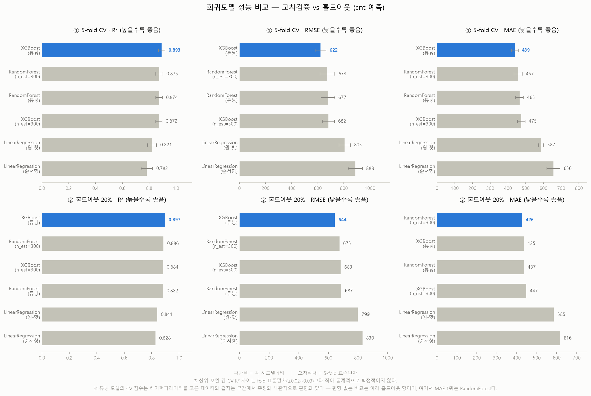
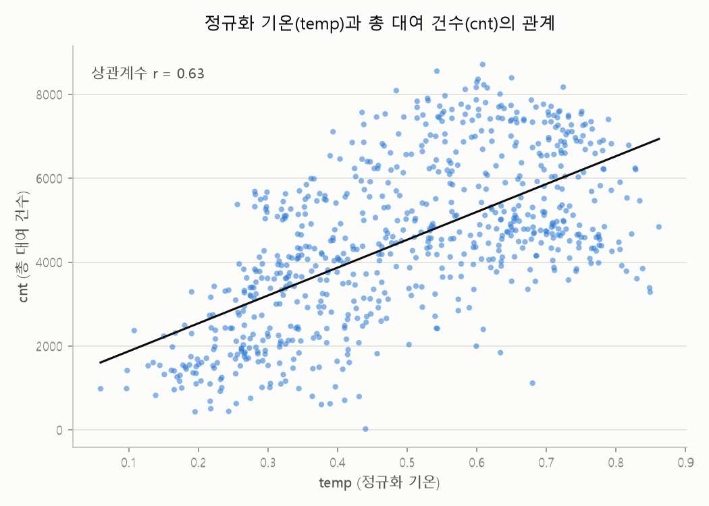
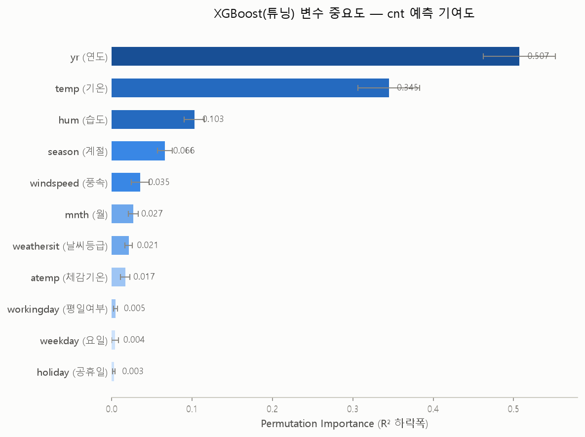

# 자전거 대여 수요 분석 (Bike Sharing Demand Analysis)

UCI Bike Sharing Dataset(2011~2012년, 일별 731건)으로 **하루 자전거 대여 건수를 무엇이 결정하는지**
분석하고 회귀 모델을 비교한 프로젝트입니다. 데이터 확인 → 정제 → EDA → 모델링 → 튜닝 → 결과 해석 →
문서화까지 전 과정을 직접 설계하고, 각 단계의 실행과 검증에 Claude Code(CLI)를 활용했습니다.

> 상세 리포트: [`docs/REPORT.md`](docs/REPORT.md) · 작업 로그: [`docs/WORKLOG.md`](docs/WORKLOG.md)

---

## 한눈에 보는 결과

| 항목 | 내용 |
|---|---|
| 데이터 | UCI Bike Sharing Dataset, 731행 (2011-01-01 ~ 2012-12-31) |
| 타겟 | `cnt` (하루 총 대여 건수), 설명변수 11개 |
| 기준 모델 | **XGBoost (튜닝)** — CV R² 0.893 ±0.024, 홀드아웃 R² 0.897, MAE 435 |
| 가장 중요한 변수 | `yr`(연도) 0.507 > `temp`(기온) 0.345 > `hum`(습도) 0.103 |
| 성능 해석 | 평균 4,504건 대비 하루 오차 약 435건(≈10%) |

**단, "XGBoost가 모든 지표에서 최고"는 아닙니다.** 상위 트리 모델 4개의 CV R² 차이(0.872~0.893)는
5-fold 표준편차(±0.024~0.026)보다 작고, 튜닝에 쓰이지 않은 홀드아웃 구간에서는 **MAE 1위가
RandomForest(426.19 vs 435.14)** 입니다. 그래서 결과를 교차검증과 홀드아웃 두 프로토콜로 나란히
싣고, 순위를 단정하지 않았습니다. (자세한 이유 → [`docs/REPORT.md` 5-2절](docs/REPORT.md))

<p align="center">
  
</p>

---

## 분석 과정

**1. 데이터 확인 · 정제** — 결측치는 0건이었지만, IQR 이상치 점검에서 `hum`(습도)이 정확히 `0.000`인
날을 1건 발견했습니다. 그날의 날씨 등급이 `weathersit=3`(약한 눈/비)이었으므로 습도 0%는 물리적으로
불가능하다고 판단해 결측 처리 후 선형보간(→0.712)했습니다. 반면 `windspeed` 이상치 13건은 레버리지를
계산해 값 자체가 비현실적이지 않음을 확인하고 **삭제하지 않고 유지**했습니다. — 이상치는 "통계적으로
튀는 값"이 아니라 "물리적으로 불가능한 값"을 기준으로 걸러야 한다고 봤습니다.

**2. 탐색적 분석** — 온도-대여량 양의 상관(r=0.63), 날씨 등급이 나빠질수록 단계적으로 하락하는 분포,
그리고 계절×요일 히트맵에서 **회원은 평일 / 비회원은 주말**이라는 이용 패턴 차이를 확인했습니다.

<p align="center">
  
  
</p>

**3. 데이터 누수 차단** — `cnt = casual + registered`라는 항등식을 먼저 확인하고 두 변수를 설명변수에서
제외했습니다. 검증 삼아 포함해서 돌려본 결과 R²=1.0000, `casual`·`registered` 계수가 정확히 1.0으로
수렴해 모델이 아무것도 예측하지 않고 항등식을 되돌려준다는 것을 확인했습니다
([`src/06_data_leakage_check.py`](src/06_data_leakage_check.py)).

**4. 모델 비교 · 과적합 검증** — 선형회귀 2종 / RandomForest / XGBoost를 동일 분할로 비교하고,
train-test 격차로 과적합을 확인했습니다. XGBoost는 train R²=1.000으로 명백히 과적합 상태였습니다.

**5. 하이퍼파라미터 튜닝** — RandomizedSearchCV(60개 조합 × 5-fold)로 튜닝해 XGBoost의 과적합 격차를
0.116 → 0.082로 줄였습니다. RandomForest는 규제가 걸리긴 했지만(train R² 0.982→0.962) 일반화 성능은
개선되지 않아 더 단순한 설정을 유지했습니다.

**6. 결과 해석** — gain importance와 permutation importance 두 방식으로 변수 중요도를 확인했습니다.

<p align="center">
  
</p>

---

## 결론

**날씨보다 "연도"가 더 크게 작용했습니다.** `yr`(2011→2012)의 permutation importance가 0.507로 기온
(0.345)보다 높았습니다. 즉 이 기간 대여량 변동의 상당 부분은 날씨가 아니라 **서비스 자체의 성장**
(이용자 기반 확대)으로 설명됩니다. 날씨 변수 중에서는 기온이 가장 중요하고, 습도가 계절보다 높게
나온 것은 계절 정보가 `mnth`·`weathersit`·`temp`에 분산돼 있기 때문으로 보입니다.

**실무적으로 읽으면** — 수요의 큰 흐름(연 단위 성장, 계절)은 예측 가능하므로 자전거 재배치·정비 인력
같은 중장기 계획에 활용할 여지가 있습니다. 다만 하루 오차가 평균 435건(≈10%) 수준이므로, 당일 단위의
정밀한 재고 배치에 그대로 쓰기에는 부족합니다.

## 한계

정직하게 적으면, 이 결과에는 아래 세 가지 제약이 있습니다.

- **미래 예측에 그대로 쓸 수 없습니다.** 1위 변수 `yr`은 이진 지표(2011=0/2012=1)이고 트리 모델은
  외삽하지 않으므로, 2013년에는 정의되지 않은 입력이 됩니다. 이번 결과는 "미래를 맞히는 모델"이
  아니라 **"2011~2012년 수요를 무엇이 설명하는가"** 에 대한 답입니다.
- **무작위 분할은 일별 시계열에 낙관적입니다.** 인접일 자기상관이 강한데 10월 3일이 train,
  10월 4일이 test에 들어갈 수 있어 성능이 부풀려졌을 가능성이 큽니다. 보고된 R²는 시간순 예측
  성능이 아니라 동일 기간 내 설명력으로 읽어야 합니다.
- **무학습 기준선과 비교하지 않았습니다.** "월평균으로 예측" 같은 naive baseline이 없어, 모델링으로
  실제 얼마를 벌었는지가 아직 정량화되지 않았습니다.

## 이상치 탐색 (보너스 분석)

주 분석과 별개로, **Isolation Forest**(contamination=5%)로 731일 중 이례적인 날 37일(5.1%)을
탐지하고, 각 날의 직접 원인 변수를 특정했습니다. 사용 변수는 기온·체감온도·습도·풍속·날씨등급·
대여수 6개입니다.

**방법** — 이상치로 판정된 각 날에 대해 변수를 하나씩 데이터셋 중앙값으로 치환해보고, 이상 점수가
가장 크게 정상 쪽으로 회복되는 변수를 그 날의 "직접 원인"으로 판정했습니다(중앙값 치환 기반 로컬
설명).

| 원인 변수 | 일수 | 비율 |
|---|---|---|
| 날씨등급 (weathersit=3, 전체의 2.9%뿐) | 24일 | 64.9% |
| 풍속 | 8일 | 21.6% |
| 체감온도 | 3일 | 8.1% |
| 기온 | 1일 | 2.7% |
| 대여수 | 1일 | 2.7% |

상위 5개 이상치(2011-01-26, 2011-10-29, 2012-12-26, 2011-02-19, 2012-10-29)는 외부 검색으로
원인을 대조해봤고, 모두 실제 기록된 기상 이벤트(겨울 폭풍, 기록적 폭우, 강풍, **허리케인 샌디**)와
일치했습니다. 특히 2012-10-29(대여수 22건, 전체 최저)는 허리케인 샌디가 워싱턴 D.C.를 강타해
대중교통이 이틀간 전면 중단된 날짜와 정확히 겹칩니다.

> 인터랙티브 대시보드: [`docs/outlier_dashboard.html`](docs/outlier_dashboard.html) · 결과표:
> [`tables/isolation_forest_outliers.csv`](tables/isolation_forest_outliers.csv) · 스크립트:
> [`src/13_isolation_forest_outliers.py`](src/13_isolation_forest_outliers.py)

## 예측 오차 분석 (보너스)

기준 모델(XGBoost 튜닝)로 731일 전체를 예측하고, 실제값과의 차이(|실제-예측|)가 가장 큰 10일을
뽑았습니다. 이 모델은 80%(584일)로 학습됐으므로 나머지 20%(147일)가 진짜 홀드아웃이며, 아래 10일 중
9일이 이 홀드아웃 구간에서 나왔습니다.

| 날짜 | 실제 | 예측 | 차이 | 구간 | 이상치 목록에 있음? |
|---|---|---|---|---|---|
| 2012-10-29 | 22 | 3,593 | **-3,571** | test | ✅ |
| 2012-03-24 | 3,372 | 5,533 | -2,161 | test | |
| 2012-07-04 | 7,403 | 5,598 | **+1,805** | test | |
| 2011-09-23 | 2,395 | 4,127 | -1,732 | test | |
| 2012-04-18 | 4,367 | 6,001 | -1,634 | test | |
| 2011-11-24 | 1,495 | 3,022 | -1,527 | test | |
| 2011-12-24 | 1,011 | 2,426 | -1,415 | test | |
| 2011-04-12 | 2,034 | 3,435 | -1,401 | test | |
| 2012-06-01 | 4,127 | 5,475 | -1,348 | train | |
| 2012-07-22 | 7,410 | 6,085 | **+1,325** | test | |

**이상치 탐지(위 섹션) 37일과 겹치는 날은 2012-10-29 단 1건뿐입니다.** 이 한 건과 나머지 9건은
서로 다른 실패 유형을 보여줍니다.

- **겹치는 1건 (2012-10-29, 허리케인 샌디)** — 입력 변수(날씨·풍속·습도) 자체가 학습 데이터에
  없던 극단값이라 이상치로도 잡히고 예측도 크게 빗나감. "이상한 입력 → 이상한 예측"이라는
  가장 직관적인 실패 유형.
- **예측 오차에만 있는 9건** — 2011-11-24(추수감사절), 2012-07-04(독립기념일),
  2011-12-24(크리스마스이브) 등. 실제 날씨 값(기온·습도·풍속·날씨등급)은 전부 평범한 범위여서
  Isolation Forest는 정상으로 판정했지만, 모델은 크게 틀렸습니다. `holiday` 이진 변수 하나로는
  "추수감사절"과 "평범한 공휴일"의 차이를 설명하지 못한다는 뜻 — **이상치 탐지로는 못 잡아내는
  모델의 진짜 약점**입니다.
- **이상치에만 있는 36건** — 날씨가 이례적이었던 날 대부분은 오히려 모델이 잘 예측했습니다.
  입력이 특이하다고 항상 예측이 나빠지는 건 아니며, 모델이 그런 날씨 패턴을 충분히
  일반화했다는 뜻입니다.

> 스크립트: [`src/14_prediction_error_analysis.py`](src/14_prediction_error_analysis.py) · 결과표:
> [`tables/worst10_predictions.csv`](tables/worst10_predictions.csv)

## 다음 단계

1. **시간순 검증** (`TimeSeriesSplit` 또는 2012 하반기 홀드아웃) — 무작위 분할이 성능을 얼마나
   부풀렸는지 확인. 최우선 과제입니다.
2. **naive baseline 비교** — 모델의 실제 부가가치 정량화
3. **잔차 진단** — 오차가 특정 계절·날씨 구간에 편중되는지 확인
4. **시드 안정성 검증** — 여러 분할에서 모델 순위가 유지되는지 확인

---

## 작업 방식 (Claude Code 활용)

분석의 방향과 판단은 제가 정하고, 실행·검증·기록을 Claude Code에 맡기는 방식으로 진행했습니다.
한 번에 "분석해줘"라고 맡긴 결과물이 아니라 단계마다 지시하고 결과를 확인한 과정이며, 그 기록이
[`docs/WORKLOG.md`](docs/WORKLOG.md)에 남아 있습니다. 특히 도움이 된 지점:

- **실행 전 위험 지적** — `casual`/`registered`를 포함해 달라고 요청했을 때 누수 위험을 먼저 짚어줘,
  이를 확인 목적의 별도 스크립트로 분리해 남기기로 결정할 수 있었습니다.
- **결과물 자체 검증** — feature importance 차트에서 값과 라벨이 어긋난 버그(정렬된 Series와 정렬되지
  않은 배열을 한 DataFrame에 섞은 인덱스 문제)를 콘솔 출력이 정상인 상태에서 잡아냈습니다.
- **환경 이슈 기록** — 사용자 경로에 한글이 포함된 Windows 환경에서 `n_jobs=-1`이 `UnicodeEncodeError`로
  실패하는 문제를 `n_jobs=1`로 우회하고, 재발 방지를 위해 프로젝트 문서에 남겼습니다.

---

## 프로젝트 구조

```
bike-sharing-demand-analysis/
├── data/          # day.csv (원본), day_processed.csv (hum=0 보간본)
├── src/           # 01~12 분석 파이프라인 (숫자 순서대로 실행)
├── figures/       # 시각화 (png)
├── tables/        # 결과표 (csv)
├── models/        # 학습된 모델 (joblib)
└── docs/          # REPORT.md (상세 리포트), WORKLOG.md (작업 로그), outlier_dashboard.html (이상치 대시보드)
```

| 스크립트 | 내용 |
|---|---|
| `01_data_overview.py` | 구조/결측치/기술통계/IQR 이상치 확인 |
| `02_clean_missing_values.py` | `hum=0` 결측 처리 및 보간 |
| `03_visualize_eda.py`, `04_visualize_season_weekday_heatmap.py` | EDA 시각화 |
| `05_baseline_linear_regression.py` | 선형회귀 baseline |
| `06_data_leakage_check.py` | `casual`+`registered` 누수 검증 (확인용) |
| `07_compare_regression_models.py`, `08_validate_models_cv_overfitting.py` | 모델 비교, 과적합·교차검증 |
| `09_tune_xgboost.py`, `10_tune_random_forest.py` | 하이퍼파라미터 튜닝 |
| `11_final_model_comparison.py` | 최종 성능 비교 (CV + 홀드아웃) |
| `12_feature_importance.py` | 변수 중요도 분석 |
| `13_isolation_forest_outliers.py` | Isolation Forest 이상치 탐지 및 원인 변수 분석 (보너스) |
| `14_prediction_error_analysis.py` | 예측 오차 최대 10일 탐색 및 이상치 목록과의 교집합 분석 (보너스) |

## 재현 방법

```bash
pip install -r requirements.txt

# 저장소 루트에서 숫자 순서대로 실행
python src/01_data_overview.py
python src/02_clean_missing_values.py
# ... 03 ~ 12
```

각 스크립트는 `data/`, `figures/`, `tables/`, `models/`를 상대 경로로 참조하므로 **저장소 루트에서**
실행해야 합니다. Windows에서 사용자 경로에 한글이 포함된 경우 joblib 병렬 처리가 실패하므로
`n_jobs=1`이 필요합니다(스크립트에 반영돼 있습니다).

## 데이터 출처

[UCI Machine Learning Repository — Bike Sharing Dataset](https://archive.ics.uci.edu/dataset/275/bike+sharing+dataset)
(Capital Bikeshare, Washington D.C., 2011–2012)

> Fanaee-T, H., & Gama, J. (2013). *Event labeling combining ensemble detectors and background knowledge.*
> Progress in Artificial Intelligence, 2(2–3), 113–127.
