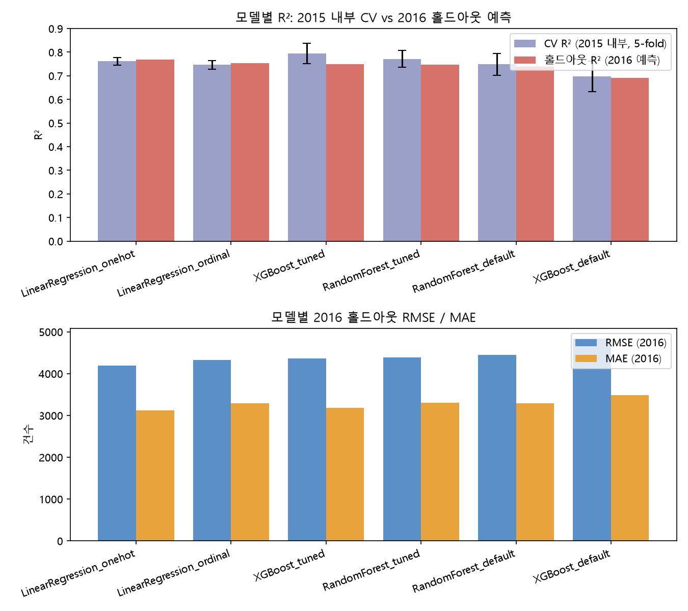
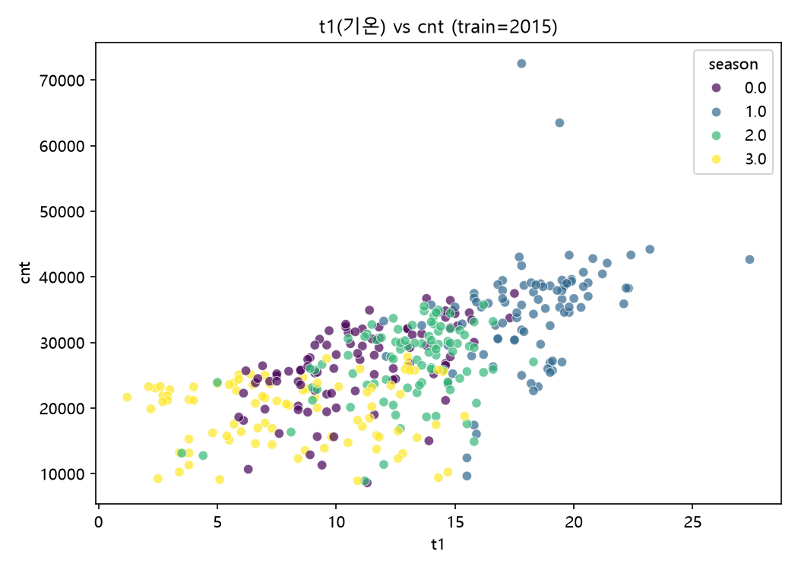
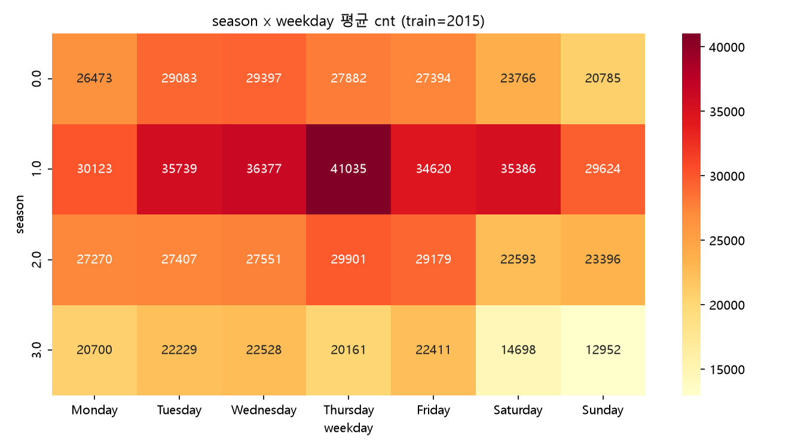
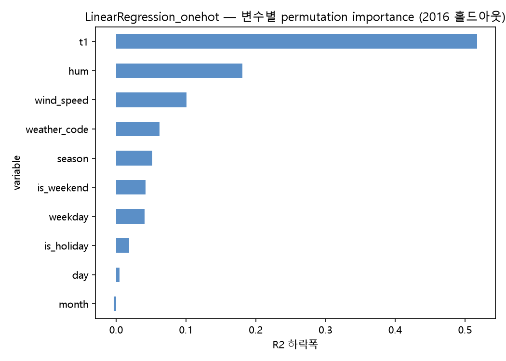

# 런던 자전거 대여 수요 분석 (London Bike Sharing Demand Analysis)

런던 자전거 대여 데이터셋(2015~2017년, 시간별)을 일별로 변환한 뒤, **2015년 데이터로 회귀모델을
학습해 2016년 대여 건수(`cnt`)를 예측**하는 프로젝트입니다. 시간별→일별 변환, EDA, 다중공선성
점검, 회귀 모델 비교·튜닝, 변수 중요도, 이상치 탐지, 예측 오차 분석까지 전 과정을 직접 설계하고,
각 단계의 실행·검증·기록에 Claude Code(CLI)를 활용했습니다.

> 상세 리포트: [`docs/REPORT.md`](docs/REPORT.md) · 작업 로그: [`docs/WORKLOG.md`](docs/WORKLOG.md) ·
> 통합 계획서: [`docs/ANALYSIS_PLAN.md`](docs/ANALYSIS_PLAN.md)

---

## 한눈에 보는 결과

| 항목 | 내용 |
|---|---|
| 데이터 | 런던 자전거 대여 데이터셋(시간별→일별 변환), train=2015년(362일) / test=2016년(365일) |
| 타겟 | `cnt`(하루 총 대여 건수). train/test는 무작위 분할이 아니라 **연도 단위 시간 분할(진짜 미래 예측 시나리오)** |
| 최종 채택 모델 | **LinearRegression(원-핫 인코딩)** — 2016 홀드아웃 R² 0.769, RMSE 4,189, MAE 3,120 |
| 가장 중요한 변수 | `t1`(기온) 0.517 > `hum`(습도) 0.181 > `wind_speed`(풍속) 0.101 |
| 성능 해석 | 2016년 평균 27,752건 대비 하루 오차 약 3,120건(≈11.2%) |

**"복잡한 모델이 항상 이기지는 않았습니다."** 하이퍼파라미터를 튜닝한 XGBoost는 2015년 내부
교차검증에서 R² 0.793으로 가장 높았지만, 진짜 미래인 2016년 예측에서는 오히려 **원-핫 인코딩
선형회귀가 R²·RMSE·MAE 세 지표 모두에서 1위**였습니다. 데이터가 362일뿐인 상황에서는 유연한
트리 모델보다 규제가 강한 선형모델이 미래로 더 잘 일반화된다는 뜻입니다. (근거 →
[`docs/REPORT.md` 4절](docs/REPORT.md))

<p align="center">
  
</p>

---

## 분석 과정

**1. 시간별 → 일별 변환** — 원본은 17,414행(1시간 단위)이었습니다. 워싱턴 프로젝트에서 확정한
집계 규칙(연속형→평균, 카운트형→합계, 날짜속성형→하루 내 동일값)을 런던에 맞게 재검증해 적용했고,
`weather_code`(날씨등급) 전용 3단계 규칙(연속 4시간 이상 지속된 최악 등급 → 최빈값 → 동률시 더
나쁜 쪽)도 그대로 재사용했습니다. 34일(106시간)의 결측 시간은 채우지 않고 존재하는 레코드만으로
집계했으며, 이 사실은 `n_hours_observed` 컬럼으로 남겨뒀습니다.

**2. 컬럼 설계 — 워싱턴과 다른 지점** — train(2015)·test(2016) 각각에서 `year`가 상수라는 걸
확인하고 **`year`를 완전히 제외**했습니다(워싱턴에서 `yr`이 중요도 1위였던 것과 정반대 상황).
`working`이 `is_holiday`·`is_weekend`의 완전한 결정론적 함수임을 362일 전부 실측 확인해 **`working`
대신 `is_holiday`+`is_weekend`를 사용**했습니다(다중공선성 회피 + 정보 손실 방지).

**3. 다중공선성 점검** — VIF 확인 결과 `t1`(기온)-`t2`(체감기온) VIF가 88~91로 심각한
다중공선성이 확인돼, 선형회귀 계열에서는 `t2`를 제외하고 `t1`만 사용했습니다(트리 모델은 영향을
받지 않아 둘 다 사용).

<p align="center">
  
  
</p>

**4. 모델 비교 · 과적합 검증** — LinearRegression(순서형/원-핫) / RandomForest / XGBoost 4종을
2015년 내부 5-fold CV로 비교했습니다. 홀드아웃(2016)은 최종 모델 확정 전까지 손대지 않았습니다.
기본 하이퍼파라미터의 XGBoost는 train R²=1.000, validation R²=0.698(gap=0.302)로 심한 과적합을
보였습니다.

**5. 하이퍼파라미터 튜닝** — RandomizedSearchCV(60개 조합×5-fold, `n_jobs=1` 고정 — 경로 한글로
인한 joblib 오류 회피)로 XGBoost(CV R² 0.698→0.793)와 RandomForest(0.748→0.771) 모두 개선했지만,
아래 6절에서 보듯 이 개선이 2016 홀드아웃 성능으로는 이어지지 않았습니다.

**6. 결과 해석** — 최종 채택 모델(원-핫 선형회귀) 기준, 원-핫으로 쪼개진 범주형 변수(season/
weather_code/weekday)는 같은 변수의 더미 컬럼을 함께 셔플하는 그룹 permutation importance로
측정했습니다.

<p align="center">
  
</p>

---

## 결론

**날씨, 그중에서도 기온이 압도적으로 중요했습니다.** `t1`(기온)의 permutation importance가
0.517로 2위 `hum`(습도, 0.181)의 거의 3배입니다. `year`를 애초에 뺐기 때문에(각 파일 내 상수라
학습 불가) 워싱턴처럼 "연도가 1위"로 나올 여지 자체가 없었고, 그 결과 이 모델은 **순수하게
날씨·달력 정보만으로 수요를 얼마나 설명할 수 있는지**를 보여줍니다. 날씨 3종(`t1`+`hum`+
`wind_speed`)의 중요도 합이 0.80에 육박해 달력 변수(요일·공휴일·계절)를 크게 앞섭니다.

**CV 1위와 홀드아웃 1위가 달랐습니다.** 2015년 내부 CV에서는 XGBoost(튜닝)가 R² 0.793으로 가장
높았지만, 실제 2016년 예측에서는 R² 0.749로 떨어져 **원-핫 선형회귀(0.769)에게 1위를 내줬습니다**
— RMSE·MAE 두 지표에서도 선형회귀가 전 모델 중 최저였습니다. 362일이라는 작은 데이터로 학습할 때는
유연한 트리 모델일수록 훈련 구간에는 더 잘 맞지만 그만큼 미래로 일반화하는 능력은 떨어질 수 있다는
것을, "CV 점수만 보고 모델을 확정하지 않는다"는 이번 계획의 원칙이 실제로 검증해준 셈입니다.

## 한계

- **`year`를 뺐기 때문에 연도별 성장 추세는 아예 모델링하지 못합니다.** 이 결과는 "런던 자전거
  수요가 해마다 어떻게 느는가"가 아니라 **"날씨·달력 정보만으로 하루 수요를 얼마나 설명할 수
  있는가"**에 대한 답입니다.
- **train이 362일뿐입니다.** 트리 모델 튜닝(RandomizedSearchCV)도 이 작은 데이터 안에서만
  이뤄졌고, 특히 `weather_code=26`(눈)처럼 2015년에 단 한 번도 등장하지 않은 범주는 원-핫
  회귀에서 계수를 전혀 학습하지 못했습니다(2016년에 1일 등장).
- **무학습 기준선과 비교하지 않았습니다.** "2015년 월평균으로 2016년을 예측" 같은 naive baseline이
  없어, 모델링으로 실제 얼마나 개선됐는지는 아직 정량화되지 않았습니다.

## 이상치 탐색 (train=2015, 보너스 분석)

Isolation Forest(contamination=5%)로 362일 중 **19일(5.2%)** 을 이상치로 탐지하고, 중앙값 치환
(median ablation)으로 각 날의 직접 원인 변수를 특정했습니다(사용 변수: t1, t2, hum, wind_speed,
weather_code, cnt).

| 원인 변수 | 일수 |
|---|---|
| `cnt`(대여수 자체가 극단값) | 6일 |
| `t1`(기온) | 5일 |
| `t2`(체감기온) | 4일 |
| `hum`(습도) | 2일 |
| `wind_speed`, `weather_code` | 각 1일 |

최상위 이상치 **2015-07-01**(원인=`t1`, cnt=42,641)은 실제로 **런던 히스로 공항 기준 36.7°C를
기록한 2015년 UK 7월 최고기온 신기록일**과 정확히 일치합니다. 두 번째 **2015-07-09**(원인=`cnt`,
cnt=72,504, 훈련 데이터 전체 최댓값)도 같은 2015년 여름 폭염 시기와 겹칩니다.

> 스크립트: [`src/12_isolation_forest_outliers.py`](src/12_isolation_forest_outliers.py) ·
> 결과표: [`tables/isolation_forest_outliers_2015.csv`](tables/isolation_forest_outliers_2015.csv)

## 예측 오차 분석 (2016, 보너스)

최종 모델(원-핫 선형회귀)로 2016년 전체를 예측해 오차가 가장 큰 10일을 뽑았습니다.

| 날짜 | 실제 | 예측 | 오차 | 비고 |
|---|---|---|---|---|
| 2016-12-25 | 36,653 | 12,408 | **24,245** | 크리스마스 — 실제로 **관측 사상 가장 따뜻한 크리스마스**(런던 약 15°C) 였음(`t1`=12.5°C로 기록). 겨울+일요일 조합의 하락 효과를 모델이 과대평가 |
| 2016-06-24 | 18,380 | 36,495 | 18,115 | **`n_hours_observed`=9** — 24시간 중 9시간만 기록된 날이라 실제값이 "반나절치 합계"에 불과함. 진짜 예측 실패가 아니라 데이터 결측이 원인 |
| 2016-06-05 | 40,229 | 27,218 | 13,011 | |
| 2016-05-08 | 44,758 | 33,453 | 11,305 | |
| 2016-05-07 | 43,819 | 32,715 | 11,104 | |

(전체 10건은 [`tables/worst10_predictions_2016.csv`](tables/worst10_predictions_2016.csv) 참고)

**2016년 자체 이상치(19일, Isolation Forest 별도 실행)와 겹치는 날은 1건(2016-09-03)뿐입니다.**
워싱턴 프로젝트와 마찬가지로 "이상치"와 "예측 오차가 큰 날"은 대체로 다른 신호였습니다. 특히
2016-06-24는 모델의 실패가 아니라 **`n_hours_observed`로 미리 표시해둔 저신뢰 날짜**였다는 점이
확인돼, 데이터 품질 플래그를 남겨둔 전처리 설계가 실제로 진단에 쓰였습니다.

> 스크립트: [`src/13_prediction_error_analysis.py`](src/13_prediction_error_analysis.py)

## 다음 단계

1. **naive baseline 비교** — "2015년 월평균으로 2016년 예측" 대비 모델의 실제 부가가치 정량화
2. **`weather_code=26`(눈) 데이터 부족 보완** — 훈련 데이터에 없는 범주라 원-핫 회귀가 전혀
   학습하지 못함. 유사 범주(`weather_code=10`, 뇌우)와 묶는 등의 처리 검토
3. **잔차 진단** — 겨울철 이상고온처럼 계절 기대와 어긋나는 날에 오차가 편중되는지 확인
4. **워싱턴과의 합동 비교** — `year` 인코딩, `casual`/`registered` 부재를 어떻게 정리할지 결정 후
   두 도시 데이터를 함께 분석

---

## 작업 방식 (Claude Code 활용)

분석의 방향과 판단은 제가 정하고, 실행·검증·기록을 Claude Code에 맡기는 방식으로 진행했습니다.
특히 이번 프로젝트에서 도움이 된 지점:

- **구조적 차이를 미리 짚어줌** — 워싱턴 규칙을 그대로 복붙하지 않고, `year`가 연도별 분할에서
  상수가 된다는 점과 `working`이 다른 두 컬럼의 결정론적 함수라는 점을 실측으로 확인한 뒤 계획에
  반영했습니다.
- **결정 전 항상 근거와 함께 제안** — 인코딩 방식·다중공선성 처리 등 열린 질문마다 "제가 선택하면
  이렇게 하겠다"는 근거 있는 제안을 먼저 받고, 최종 승인 후 진행했습니다.
- **실행 도중 발견된 문제를 즉시 반영** — 원-핫 선형회귀가 최종 1위로 나오자, 애초에 트리 모델
  전용으로 짜뒀던 변수 중요도·오차 분석 스크립트를 그 자리에서 원-핫 구조에 맞게 다시 작성했습니다.
- **실제 기상 기록으로 교차 검증** — 이상치·오차 상위 날짜를 각각 실제 런던 기상 기록(2015년 7월
  UK 최고기온 신기록, 2016년 관측 사상 가장 따뜻한 크리스마스)과 대조해 통계적 판정이 실제
  사건과 일치하는지 확인했습니다.

전체 작업 기록은 [`docs/WORKLOG.md`](docs/WORKLOG.md)에 있습니다.

---

## 프로젝트 구조

```
02-london/
├── data/          # london_merged.csv(원본, 시간별) / day.csv(일별 변환) / day_2015.csv, day_2016.csv(train/test)
├── src/           # 01~14 분석 파이프라인 (숫자 순서대로 실행)
├── figures/       # 시각화 (png)
├── tables/        # 결과표 (csv)
├── models/        # 학습된 모델 (joblib)
└── docs/          # ANALYSIS_PLAN.md(통합 계획서), REPORT.md(상세 리포트), WORKLOG.md(작업 로그)
```

| 스크립트 | 내용 |
|---|---|
| `01_day_conversion.py` | 시간별→일별 변환 |
| `02_data_overview.py` | train/test 구조·분포 확인 |
| `03_visualize_eda.py` | EDA 시각화 4종 |
| `04_multicollinearity_check.py` | working 다중공선성 재검증, t1-t2 VIF |
| `05_baseline_linear_regression.py` | 선형회귀 baseline (2015 내부 5-fold CV) |
| `06_compare_regression_models.py` | 4개 모델 기본 비교 |
| `07_validate_models_cv_overfitting.py` | CV fold별 train-val R² 격차로 과적합 확인 |
| `08_tune_xgboost.py`, `09_tune_random_forest.py` | 하이퍼파라미터 튜닝 |
| `10_final_model_comparison.py` | 최종 비교 (2015 CV + 2016 홀드아웃) |
| `11_feature_importance.py` | 변수 중요도 (그룹 permutation importance) |
| `12_isolation_forest_outliers.py` | 이상치 탐지 (2015, 보너스) |
| `13_prediction_error_analysis.py` | 예측 오차 분석 (2016, 보너스) |
| `14_visualize_final_comparison.py` | 최종 성능 비교 그림 |

## 재현 방법

```bash
pip install -r requirements.txt

# 저장소 루트(02-london/)에서 숫자 순서대로 실행
python src/01_day_conversion.py
python src/02_data_overview.py
# ... 03 ~ 14
```

각 스크립트는 `data/`, `figures/`, `tables/`, `models/`를 상대 경로로 참조하므로 **`02-london/`
루트에서** 실행해야 합니다. Windows에서 사용자 경로에 한글이 포함된 경우 joblib 병렬 처리가
실패하므로 `n_jobs=1`이 필요합니다(스크립트에 반영돼 있습니다).

## 데이터 출처

Kaggle — [London bike sharing dataset](https://www.kaggle.com/datasets/hmavrodiev/london-bike-sharing-dataset)
(Hristo Mavrodiev, Transport for London 공개 데이터 기반, 2015–2017)
