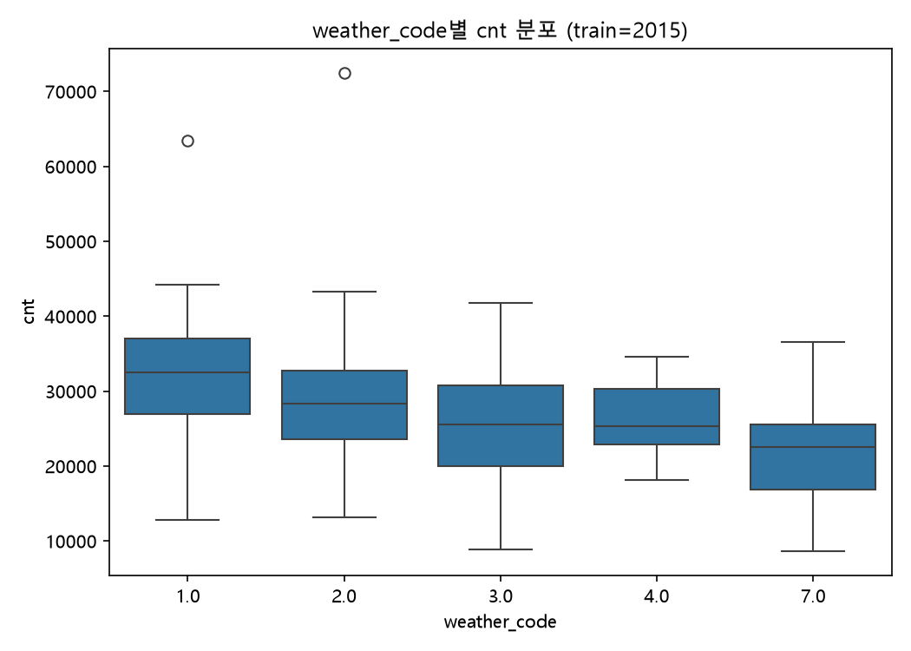
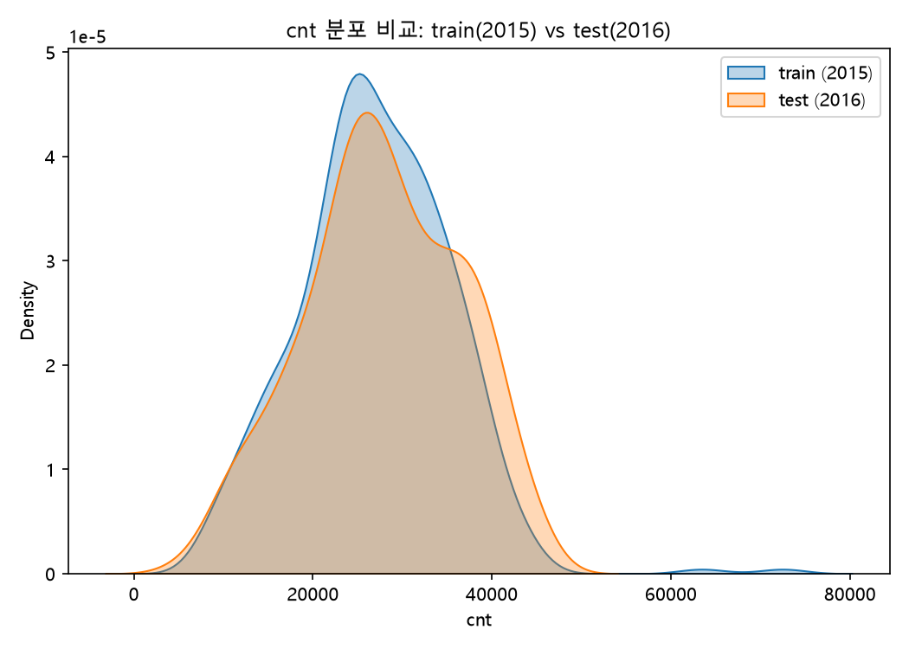

# 분석 리포트: 런던 자전거 대여 수요 예측

## 1. 배경 및 목적

런던 자전거 대여 데이터셋(시간별, 2015-01-04~2017-01-03)을 일별로 변환한 뒤, **2015년 데이터로
회귀모델을 학습해 2016년 대여 건수(`cnt`)를 예측**하는 것이 목표다. `01-washington/` 프로젝트에서
확립한 워크플로우(전처리→EDA→회귀분석→변수중요도→이상치탐지→오차분석→리포트)를 기반으로 삼되,
train/test를 무작위 분할이 아니라 **연도 단위 시간 분할**로 구성해 워싱턴이 README 한계 절에 남긴
"무작위 분할이 자기상관 때문에 성능을 부풀렸을 가능성"이라는 미해결 과제를 처음부터 피하도록
설계했다. 상세 계획은 [`docs/ANALYSIS_PLAN.md`](ANALYSIS_PLAN.md) 참고.

## 2. 데이터 개요

### 2-1. 원본 및 변환

- 원본: `data/london_merged.csv`, 17,414행(1시간 단위), 결측치 0건, 컬럼 10개
  (`timestamp, cnt, t1, t2, hum, wind_speed, weather_code, is_holiday, is_weekend, season`)
- 일별 변환: `src/01_day_conversion.py`가 워싱턴의 시간별→일별 집계 규칙을 런던에 맞게 적용해
  `data/day.csv`(730행) 생성. 34일(총 106시간)의 결측 시간은 채우지 않고 존재하는 레코드만으로
  집계했으며, 관측 시간 수는 `n_hours_observed` 컬럼으로 남겼다.
- train/test 분리: `data/day_2015.csv`(362행, 2015-01-04~12-31), `data/day_2016.csv`
  (365행, 2016-01-01~12-31). 2017년 3일치는 제외.

### 2-2. 컬럼 설계 — 워싱턴과 다른 판단이 필요했던 지점

| 컬럼 | 판단 | 근거 |
|---|---|---|
| `year` | **완전 제외** | train은 2015, test는 2016 하나씩뿐이라 각 파일 내에서 상수 — 트리 모델은 분기 불가, 선형회귀는 계수가 무의미. 포함하면 2016 예측 시 훈련에서 못 본 값으로 외삽하는 꼴이 됨. 워싱턴에서 `yr`이 permutation importance 1위(0.507)였던 것과 정반대 상황 |
| `working` | **제외**, `is_holiday`+`is_weekend` 사용 | `working == (is_holiday==0)&(is_weekend==0)`이 362행 전부 성립함을 실측 확인(`src/04_multicollinearity_check.py`) — 셋을 함께 쓰면 완전 다중공선성. `working` 하나만 쓰면 "휴일이라 쉬는 날"과 "주말이라 쉬는 날"을 구분 못 함 |
| `weekday` | 선형회귀=원-핫, 트리=달력 순서(월=0~일=6) 정수 | 문자열(Monday~Sunday) 그대로는 모델에 못 넣음. 순서형은 선형회귀에 근거 없는 선형 가정을 강제하므로 원-핫이 적절, 트리는 달력 순서가 실제 평일/주말 클러스터링을 반영해 유효한 순서 |
| `t2`(체감기온) | **선형회귀 계열에서만 제외** | VIF 점검(3-2절)에서 `t1`-`t2` VIF 88~91로 심각한 다중공선성 확인. 트리 모델은 다중공선성에 영향받지 않아 둘 다 사용 |
| `n_hours_observed` | 모델 피처 제외, 진단용으로만 사용 | train이 362행뿐이라 저신뢰 날짜를 빼면 데이터가 더 줄어듦. 결측 많은 날의 예측 오차를 사후에 설명하는 용도로 활용(7-2절 참고) |

## 3. 탐색적 데이터 분석 (EDA)

### 3-1. train/test 분포 비교 (`src/02_data_overview.py`)

`season`(92/92/91~92/87~91), `is_holiday`(355 vs 357일이 0), `is_weekend`(259 vs 260일이 0) 모두
2015·2016 사이에 심하게 쏠려있지 않음을 확인했다. `cnt` 평균은 train 26,903 / test 27,752로
비슷했지만, train 쪽에 극단적으로 큰 값(최댓값 72,504)이 있어 분포 형태 자체는 다를 수 있다.

`weather_code=26`(눈)은 **train(2015)에 단 한 번도 등장하지 않고 test(2016)에만 1건** 있다 —
이 때문에 원-핫 인코딩 선형회귀는 해당 범주의 계수를 학습할 기회가 아예 없었다(6-2절 참고).

### 3-2. 다중공선성 점검 (`src/04_multicollinearity_check.py`)

| feature | VIF |
|---|---|
| `t1` | 88.35 |
| `t2` | 91.34 |
| `hum` | 1.49 |
| `wind_speed` | 1.18 |
| `month` | 1.81 |
| `day` | 1.00 |

`t1`-`t2` VIF가 통상 기준(10)을 크게 초과해, 선형회귀 계열에서는 `t2`를 제외했다.

### 3-3. 주요 시각화

  
  

  
  

계절×요일 히트맵에서 여름(season=1) 목요일이 하루 평균 41,035건으로 가장 높고, 겨울(season=3)
일요일이 12,952건으로 가장 낮다 — 계절 진폭이 요일 진폭보다 훨씬 크다.

## 4. 회귀 모델링

### 4-1. baseline 및 4개 모델 기본 비교 (`src/05`, `src/06`)

평가는 2016을 전혀 건드리지 않고 2015 내부 5-fold CV로만 진행했다.

| 모델 | CV R² | CV MAE |
|---|---|---|
| LinearRegression(원-핫) | 0.762 ±0.016 | 2,898 |
| RandomForest(default) | 0.748 ±0.047 | 2,784 |
| LinearRegression(순서형) | 0.746 ±0.018 | 2,946 |
| XGBoost(default) | 0.698 ±0.065 | 2,950 |

### 4-2. 과적합 확인 (`src/07`)

추가로 홀드아웃을 떼어내는 대신, 5-fold CV의 각 fold에서 train-fold R²와 val-fold R²를 직접
비교했다.

| 모델 | train R² | val R² | gap |
|---|---|---|---|
| LinearRegression(순서형) | 0.773 | 0.746 | 0.027 |
| RandomForest(default) | 0.964 | 0.748 | 0.216 |
| XGBoost(default) | **1.000** | 0.698 | **0.302** |

기본 설정의 XGBoost는 훈련 데이터를 완전히 암기(R²=1.000)하면서 검증 성능은 가장 낮아, 튜닝이
필수적임을 확인했다.

### 4-3. 하이퍼파라미터 튜닝 (`src/08`, `src/09`)

RandomizedSearchCV(5-fold CV, `n_iter=60`, `n_jobs=1`)로 2015 내부에서만 튜닝했다.

| 모델 | 튜닝 전 CV R² | 튜닝 후 CV R² |
|---|---|---|
| XGBoost | 0.698 | **0.793** |
| RandomForest | 0.748 | 0.771 |

### 4-4. 최종 비교 — 2015 CV vs 2016 진짜 홀드아웃 (`src/10`)

튜닝까지 마친 모델을 2015 전체로 재학습해 2016 전체를 한 번만 예측했다.

| 모델 | CV R²(2015) | 홀드아웃 R²(2016) | 홀드아웃 RMSE | 홀드아웃 MAE |
|---|---|---|---|---|
| **LinearRegression(원-핫)** | 0.762 | **0.769** | **4,188.99** | **3,119.63** |
| LinearRegression(순서형) | 0.746 | 0.754 | 4,321.40 | 3,295.16 |
| XGBoost(튜닝) | **0.793** | 0.749 | 4,367.95 | 3,186.68 |
| RandomForest(튜닝) | 0.771 | 0.746 | 4,391.60 | 3,302.78 |
| RandomForest(default) | 0.748 | 0.739 | 4,452.37 | 3,285.97 |
| XGBoost(default) | 0.698 | 0.691 | 4,841.63 | 3,486.57 |

**CV 1위(XGBoost 튜닝, 0.793)와 홀드아웃 1위(LinearRegression 원-핫, 0.769)가 다르다.** 게다가
원-핫 선형회귀는 R²·RMSE·MAE **세 지표 모두**에서 1위를 차지했다 — 워싱턴에서는 지표별로 1위가
갈렸던 것과 달리, 이번에는 단일 모델이 전 지표를 석권했다. 원-핫 선형회귀의 홀드아웃 R²(0.769)가
CV R²(0.762)보다 오히려 높다는 점도 특기할 만하다 — 2016년이 2015년보다 유난히 "설명하기 쉬운"
해였을 가능성, 혹은 CV 표준편차(±0.016)가 원래 작아 우연한 변동 범위 안이라는 뜻으로 해석했다.
반대로 XGBoost(튜닝)는 CV→홀드아웃 하락폭(0.793→0.749, -0.044)이 가장 크다 — 362일이라는 작은
데이터에서는 유연한 트리 모델일수록 CV 자체에도 어느 정도 과적합되며, 그 이점이 진짜 미래 데이터로는
잘 이어지지 않는다는 근거다.

## 5. 최종 모델 및 변수 중요도

최종 채택 모델: **LinearRegression(원-핫 인코딩)**. `src/11_feature_importance.py`에서 회귀
계수와 함께, 원-핫으로 쪼개진 범주형 변수(season/weather_code/weekday)는 같은 변수의 더미 컬럼을
전부 함께 셔플하는 **그룹 permutation importance**(2016 홀드아웃 R² 하락폭 기준)로 측정했다.

| 변수 | permutation importance | 비고 |
|---|---|---|
| `t1`(기온) | **0.517** | 압도적 1위 |
| `hum`(습도) | 0.181 | |
| `wind_speed`(풍속) | 0.101 | |
| `weather_code`(날씨등급, 5개 더미) | 0.062 | |
| `season`(계절, 3개 더미) | 0.052 | |
| `is_weekend` | 0.042 | |
| `weekday`(6개 더미) | 0.040 | |
| `is_holiday` | 0.018 | |
| `day` | 0.005 | 사실상 무의미 |
| `month` | -0.005 | 노이즈 수준(음수는 우연한 변동) |

날씨 3종(`t1`+`hum`+`wind_speed`)의 중요도 합이 0.80에 달해 달력 변수(계절·요일·공휴일 합산
0.152)를 크게 앞선다. `year`를 원천적으로 뺐기 때문에, 이 모델은 "날씨·달력만으로 수요를 얼마나
설명하는가"에 대한 순수한 답이다.

`weather_code_26.0`(눈) 더미의 회귀 계수는 정확히 0.0 — train(2015)에 이 범주가 한 번도 없어
모델이 아예 학습하지 못했기 때문이다(3-1절).

## 6. 이상치 탐색 (train=2015, 보너스)

`src/12_isolation_forest_outliers.py`: Isolation Forest(contamination=5%), 사용 변수
`t1, t2, hum, wind_speed, weather_code, cnt`. **19일(5.2%)** 이상치 탐지, 중앙값 치환으로 원인
변수 특정.

| 원인 변수 | 일수 | 비율 |
|---|---|---|
| `cnt` | 6일 | 31.6% |
| `t1` | 5일 | 26.3% |
| `t2` | 4일 | 21.1% |
| `hum` | 2일 | 10.5% |
| `wind_speed` | 1일 | 5.3% |
| `weather_code` | 1일 | 5.3% |

워싱턴에서는 날씨등급(weathersit)이 원인의 64.9%를 차지했던 것과 달리, 런던에서는 원인이
`cnt`(대여수 자체의 극단값)·기온·체감기온에 고르게 분산돼 있다.

상위 2개 이상치를 실제 기상 기록과 대조했다:

- **2015-07-01**(원인=`t1`, cnt=42,641) — 런던 히스로 공항에서 **36.7°C**를 기록한, 당시 **UK 7월
  최고기온 신기록일**과 정확히 일치. ([Met Office 자료](https://www.metoffice.gov.uk/binaries/content/assets/metofficegovuk/pdf/weather/learn-about/uk-past-events/interesting/2015/heatwave-1-july-2015---met-office.pdf))
- **2015-07-09**(원인=`cnt`, cnt=72,504, train 전체 최댓값) — 같은 2015년 여름 폭염 시기에 속한다.

## 7. 예측 오차 분석 (2016, 보너스)

### 7-1. 오차 상위 10일

`src/13_prediction_error_analysis.py`로 최종 모델(원-핫 선형회귀)의 2016 전체 예측 오차 상위
10일을 뽑았다.

| 날짜 | 실제 | 예측 | 오차 |
|---|---|---|---|
| 2016-12-25 | 36,653 | 12,407.6 | 24,245.4 |
| 2016-06-24 | 18,380 | 36,494.7 | 18,114.7 |
| 2016-06-05 | 40,229 | 27,217.5 | 13,011.5 |
| 2016-05-08 | 44,758 | 33,452.9 | 11,305.1 |
| 2016-05-07 | 43,819 | 32,715.0 | 11,104.0 |
| 2016-07-30 | 45,608 | 34,679.5 | 10,928.5 |
| 2016-09-03 | 15,265 | 25,672.9 | 10,407.9 |
| 2016-07-31 | 44,678 | 34,589.6 | 10,088.4 |
| 2016-05-29 | 30,760 | 21,205.3 | 9,554.7 |
| 2016-12-05 | 26,231 | 16,833.3 | 9,397.7 |

### 7-2. 최상위 두 오차의 원인

- **2016-12-25 (최대 오차)** — 실제값이 예측보다 24,245건 높다. 이날은 `t1=12.5°C`로 기록됐고,
  실제로 **런던 관측 사상 가장 따뜻한 크리스마스 중 하나**(약 15°C 기록)였다는 것을 웹 검색으로
  확인했다. 모델은 겨울(`season=3`)+일요일(`is_weekend=1`)이라는 두 하락 요인을 그대로 적용해
  낮게 예측했지만, 실제로는 이례적으로 따뜻한 날씨가 겨울·주말 효과를 압도했다 — 선형모델이
  변수 간 **상호작용(따뜻한 겨울 주말의 비선형적 효과)** 을 포착하지 못한 사례로 해석한다.
- **2016-06-24 (2위 오차)** — `n_hours_observed=9`(24시간 중 9시간만 관측). 실제 `cnt`(18,380)는
  "하루 전체 수요"가 아니라 **9시간치 부분합**이라,애초에 모델이 예측한 "하루 전체 예상 수요"
  (36,495)와 비교 대상이 될 수 없다. 이는 모델의 예측 실패가 아니라 **전처리 단계에서 이미 알고
  있던 데이터 품질 이슈**(2-1절)가 오차 분석에서 그대로 드러난 것이다.

### 7-3. 이상치 목록과의 교집합

2016년 자체 분포로 별도 실행한 Isolation Forest(contamination=5%)는 19일을 이상치로 탐지했다.
오차 상위 10일과 겹치는 날은 **2016-09-03 단 1건**뿐이다. 워싱턴 프로젝트와 마찬가지로 "입력이
이례적인 날"과 "예측이 크게 틀린 날"은 대체로 다른 신호라는 결론이 재확인됐다 — `holiday`/
`season`처럼 선형모델이 다루는 변수만으로는 포착 안 되는 상호작용(2016-12-25)과, 데이터 자체의
관측 결손(2016-06-24)이 오차 상위권을 차지했고, 둘 다 "통계적으로 이례적인 날씨"는 아니었다.

## 8. 한계 및 향후 과제

### 8-1. 결론의 적용 범위를 제한하는 것

- **연도별 성장 추세를 모델링하지 않는다.** `year`를 원천 제외했으므로, 이 결과는 "런던 자전거
  수요가 해마다 어떻게 느는가"가 아니라 "날씨·달력 정보만으로 하루 수요를 얼마나 설명할 수
  있는가"에 대한 답이다.
- **`weather_code=26`(눈) 범주는 사실상 모델링되지 않았다.** train에 단 한 번도 없어 원-핫
  회귀가 계수를 학습할 기회가 없었다. 2016년에 1일 등장했지만 그 예측이 오차 상위 10일에
  포함되지는 않았다(우연히 다른 조건이 평이했을 가능성).
- **train이 362일뿐이다.** 특히 트리 모델 튜닝은 이 작은 표본 내에서만 이뤄져 튜닝 자체가
  다소 불안정할 수 있다(RandomizedSearchCV CV 표준편차가 XGBoost 튜닝 기준 ±0.043으로 다른
  모델보다 크다).

### 8-2. 다음 반복에서 이어갈 것

1. **naive baseline 비교** — "2015년 월별 평균으로 2016년을 예측"하는 단순 기준선을 세워, 모델링이
   실제로 얼마나 개선했는지 정량화.
2. **`weather_code=26` 데이터 부족 보완** — 유사 범주(`weather_code=10`, 뇌우)와 통합하거나,
   순서형 인코딩(선형회귀에서도)으로 대체해 값이 아예 사라지는 문제를 완화하는 방안 검토.
3. **잔차 진단** — 2016-12-25처럼 "계절 기대를 벗어난 날씨"에서 오차가 체계적으로 커지는지,
   상호작용 항(예: `season × t1`)을 추가하면 개선되는지 확인.
4. **워싱턴과의 합동 비교** — 두 도시 데이터를 하나로 합치려면 `year` 인코딩 방식, `casual`/
   `registered` 부재, `weather_code`/`weathersit` 값 체계 차이를 먼저 정리해야 한다.
