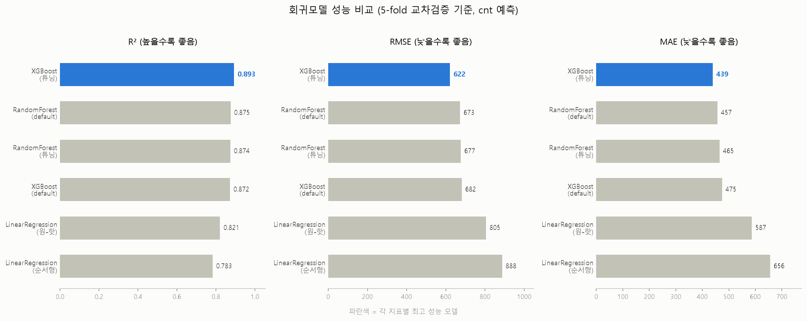
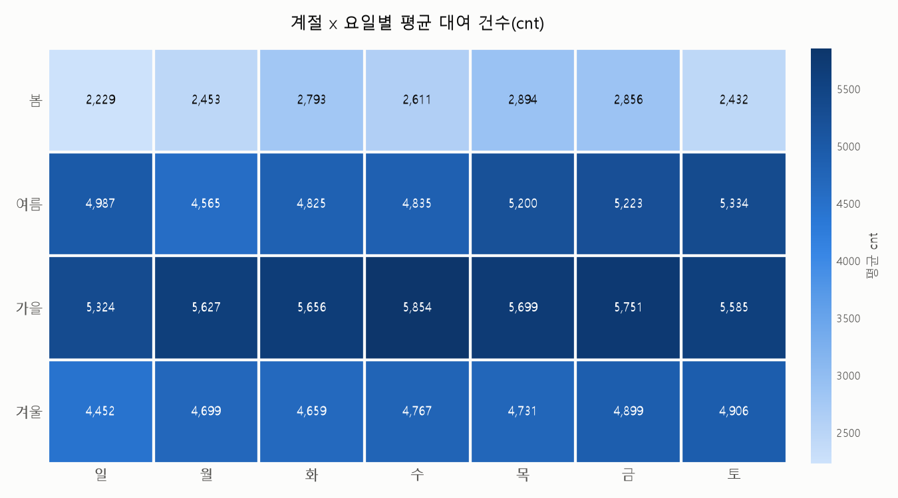

# 자전거 대여 수요 예측 (Bike Sharing Demand Analysis)

**Claude Code(CLI)를 활용해 데이터 확인 → 정제 → 탐색적 분석 → 시각화 → 모델링 → 결과 해석 → 문서화까지 전 과정을 수행한 데이터 분석 프로젝트입니다.**

UCI Bike Sharing Dataset(2011~2012년, 일별 731건)을 사용해 날씨·달력 정보로 하루 자전거 대여
건수를 예측하고, 어떤 요인이 수요에 가장 큰 영향을 미치는지 분석했습니다.

> 상세 리포트는 [`docs/REPORT.md`](docs/REPORT.md), 분석을 진행하며 실시간으로 남긴 작업 로그는
> [`docs/WORKLOG.md`](docs/WORKLOG.md)에서 확인할 수 있습니다.

---

## 핵심 결과 요약

| 항목 | 내용 |
|---|---|
| 데이터 | UCI Bike Sharing Dataset, 731행 (2011-01-01 ~ 2012-12-31) |
| 타겟 변수 | `cnt` (하루 총 대여 건수) |
| 최종 모델 | **XGBoost (튜닝)** |
| 성능 (5-fold CV) | **R² = 0.893**, RMSE = 621.66, MAE = 439.36 |
| 가장 중요한 변수 | `yr`(연도) > `temp`(기온) > `hum`(습도) |

<p align="center">
  
</p>

---

## 분석 과정

### 1. 데이터 확인
731행 16열, 결측치 0건을 확인했으나 `hum`(습도) 컬럼에서 물리적으로 불가능한 `0.000` 값 1건을
IQR 이상치 검사로 발견했습니다.

### 2. 데이터 정제
`hum=0`인 날(비/눈이 온 날임에도 습도 0%)을 센서 오류로 판단해 결측 처리 후 시간축 선형보간으로
보정했습니다. windspeed의 이상치 13건은 회귀 레버리지 분석으로 실측 강풍일임을 확인해 유지했습니다.

### 3. 탐색적 분석 & 시각화
온도-대여량 상관관계(r=0.63), 날씨등급별 분포, 계절/요일별 경향, 계절×요일 히트맵을 통해
날씨와 대여량의 관계, 회원/비회원의 이용 패턴 차이(평일 vs 주말)를 확인했습니다.

<p align="center">
  
  
</p>

### 4. 회귀 모델링
`cnt = casual + registered`라는 항등식을 발견해 **데이터 누수(data leakage)를 사전에 차단**하고
(`casual`, `registered`를 설명변수에서 제외), 6개 모델(선형회귀 2종, RandomForest, XGBoost — 각 튜닝 전/후)을
동일한 train/test 분할과 5-fold 교차검증으로 공정하게 비교했습니다.

### 5. 과적합 검증 & 하이퍼파라미터 튜닝
train/test 성능 격차로 과적합 여부를 확인하고, RandomizedSearchCV(5-fold CV, 60개 조합)로 튜닝했습니다.
XGBoost는 튜닝으로 성능과 일반화가 함께 개선(R² 0.872→0.893)됐지만, RandomForest는 튜닝 효과가
거의 없었습니다 — 배깅 기반 모델이 이미 자체적으로 과적합을 완화하는 구조이기 때문이라는 점을
확인하고 default 설정을 유지했습니다 (자세한 원인은 [`docs/REPORT.md`](docs/REPORT.md) 참고).

### 6. 결과 해석 (Feature Importance)
Permutation importance와 gain importance 두 방식을 교차 검증해 `yr`(연도)이 날씨 변수보다도
예측에 더 크게 기여한다는, 직관과 다른 결과를 확인하고 그 이유(연도별 서비스 성장 추세)를 해석했습니다.

<p align="center">
  
</p>

---

## Claude Code 활용 워크플로우 및 역량

이 프로젝트는 Claude Code에게 "분석해줘"라고 한 번에 맡긴 결과물이 아니라, **각 단계마다 사용자가
방향을 지시하고 Claude Code가 실행·검증·보고하는 반복적 협업 과정**으로 진행되었습니다.
아래는 그 과정에서 실제로 있었던 구체적인 사례입니다.

- **비판적 실행 — 지시를 맹목적으로 따르지 않음**
  "casual, registered를 포함해서 회귀분석해달라"는 요청에 곧바로 실행하지 않고, `cnt = casual + registered`
  관계로 인한 데이터 누수 위험을 먼저 설명한 뒤 진행 여부를 확인했습니다. 이후 사용자가 "그래도 포함해서
  보여달라"고 요청하자 실제로 R²=1.0000이 나오는 것을 직접 보여주며 왜 그런 결과가 나오는지 설명했습니다
  (`src/06_data_leakage_check.py`).

- **자기 검증 — 결과를 생성만 하지 않고 확인함**
  Feature importance 시각화를 생성한 뒤 차트를 직접 눈으로 검토하는 과정에서, 값과 라벨이 어긋나 있는
  버그(정렬된 pandas Series와 정렬 안 된 numpy 배열을 한 DataFrame에 섞어 넣어 인덱스가 밀리는 문제)를
  발견했습니다. 콘솔 출력은 정상이었지만 차트가 이상하다는 걸 알아채고 원인을 추적해 수정한 뒤
  재생성했습니다.

- **통계적 엄격함**
  단일 train/test 분할 결과만으로 "어떤 모델이 낫다"고 결론짓지 않고, train-test 성능 격차로 과적합
  여부를 확인하고, 5-fold 교차검증으로 결과가 우연이 아님을 재확인했습니다. 변수 중요도도 모델 내장
  지표 하나만이 아니라 permutation importance로 교차 검증했습니다.

- **환경 이슈 해결 및 재사용 가능한 지식으로 기록**
  Windows에서 사용자 경로에 한글이 포함된 환경에서 `RandomizedSearchCV(n_jobs=-1)`이
  `UnicodeEncodeError`로 실패하는 문제를 진단하고 `n_jobs=1`로 우회했으며, 이 사실을 프로젝트 문서
  (`CLAUDE.md`)에 남겨 이후 작업에서 같은 문제를 반복하지 않도록 했습니다.

- **장시간 작업의 백그라운드 처리**
  하이퍼파라미터 탐색(조합 60개 × 5-fold = 300회 학습)처럼 시간이 걸리는 작업은 백그라운드로 실행하고,
  완료되면 결과를 검증해 보고하는 방식으로 대화 흐름을 끊지 않고 작업을 이어갔습니다.

- **지속적 문서화**
  분석 각 단계가 끝날 때마다 작업 로그와 프로젝트 컨텍스트 문서를 갱신해, 언제든 이전 세션의 결정 근거
  (왜 이 변수를 뺐는지, 왜 이 모델을 채택했는지)를 추적할 수 있도록 했습니다. 이 저장소의
  [`docs/WORKLOG.md`](docs/WORKLOG.md)가 그 기록입니다.

**요약하면**: Claude Code는 단순 실행 도구가 아니라, 데이터 누수 같은 방법론적 위험을 사전에 짚어내고,
자신이 만든 결과물을 스스로 검증해 버그를 잡아내며, 통계적으로 신뢰할 수 있는 결론을 내기 위한
검증 절차(과적합 확인, 교차검증, 중요도 교차검증)를 갖추고, 그 전 과정을 재현 가능하게 문서화하는
방식으로 활용되었습니다.

---

## 프로젝트 구조

```
bike-sharing-demand-analysis/
├── README.md                 # 이 파일
├── requirements.txt
├── data/
│   ├── day.csv                # 원본 데이터 (UCI Bike Sharing Dataset)
│   └── day_processed.csv      # hum=0 보간 처리된 정제 데이터
├── src/                        # 분석 파이프라인 (숫자 순서대로 실행)
│   ├── 01_data_overview.py            # 데이터 구조/결측치/기술통계/이상치 확인
│   ├── 02_clean_missing_values.py     # hum=0 결측 처리 및 보간
│   ├── 03_visualize_eda.py            # 온도/날씨/계절/요일 시각화
│   ├── 04_visualize_season_weekday_heatmap.py
│   ├── 05_baseline_linear_regression.py
│   ├── 06_data_leakage_check.py       # casual+registered 누수 검증(비교용)
│   ├── 07_compare_regression_models.py
│   ├── 08_validate_models_cv_overfitting.py  # 과적합 확인 + 5-fold CV
│   ├── 09_tune_xgboost.py
│   ├── 10_tune_random_forest.py
│   ├── 11_final_model_comparison.py
│   └── 12_feature_importance.py
├── figures/                    # 생성된 시각화 (png)
├── tables/                     # 생성된 결과표 (csv)
├── models/                     # 최종 모델 (joblib)
│   ├── xgboost_tuned_final.joblib
│   └── linear_regression_baseline.joblib
└── docs/
    ├── REPORT.md                # 상세 분석 리포트
    └── WORKLOG.md               # 실제 작업 로그 (원본 그대로)
```

## 재현 방법

```bash
pip install -r requirements.txt

# 파이프라인 순서대로 실행 (저장소 루트에서)
python src/01_data_overview.py
python src/02_clean_missing_values.py
python src/03_visualize_eda.py
python src/04_visualize_season_weekday_heatmap.py
python src/05_baseline_linear_regression.py
python src/06_data_leakage_check.py
python src/07_compare_regression_models.py
python src/08_validate_models_cv_overfitting.py
python src/09_tune_xgboost.py
python src/10_tune_random_forest.py
python src/11_final_model_comparison.py
python src/12_feature_importance.py
```

각 스크립트는 `data/`, `figures/`, `tables/`, `models/`를 기준 경로로 사용하므로 저장소 루트에서
실행해야 합니다. (Windows에서 사용자 경로에 한글이 포함된 경우 `n_jobs=1`이 필요한 이유는
`docs/REPORT.md`와 스크립트 주석을 참고하세요.)

## 데이터 출처

[UCI Machine Learning Repository — Bike Sharing Dataset](https://archive.ics.uci.edu/dataset/275/bike+sharing+dataset)
(Capital Bikeshare, Washington D.C., 2011–2012)

## 한계 및 다음 단계

이번 분석은 어디까지 검증했고 어디서 스코프를 제한했는지를 아래처럼 구분해 남겼습니다 — 각 항목이
**최종 모델(XGBoost)의 신뢰도에 실제로 영향을 주는지**를 기준으로 나눴습니다.

**최종 모델과는 무관하게 확인된 것 (baseline 해석 보강용)**
- `temp`-`atemp` 다중공선성: 선형회귀 baseline 계수 해석에는 유효한 이슈지만, 최종 채택 모델은
  트리 기반(XGBoost)이라 다중공선성에 영향을 받지 않음. VIF 정량화는 baseline 해석을 보강하는
  차원의 다음 단계로 남겨둠.

**다음 반복에서 이어갈 것**
- **잔차 진단**: 예측 vs 실제 값 플롯으로 XGBoost 오차가 특정 계절·날씨 구간에 편중되는지 확인
- **데이터 기간 확장**: `yr`이 가장 중요한 변수로 나온 것이 실제 성장 추세인지 2개년 표본 특유의
  패턴인지는, 3년차 이상 데이터가 확보되면 검증 가능
- **시드 안정성 검증**: 지금까지 모델 비교는 `random_state=42` 한 번의 분할 기준 — 여러 시드로
  반복해 순위가 안정적인지 확인하면 결론의 신뢰도를 한 단계 더 높일 수 있음
- **RandomForest 재탐색**: 이번 60개 조합 무작위 탐색에서는 유의미한 개선을 찾지 못함 — 더 넓은
  탐색 공간이나 ExtraTrees 등 다른 앙상블 구조로 추가 실험할 여지가 있음

이 프로젝트가 보여주려는 것은 "완결된 최종 결과물"이 아니라, Claude Code와 함께 가설을 검증하고
다음 우선순위를 판단해가는 반복적인 분석 과정입니다. 위 항목들은 그 다음 반복에서 이어갈 구체적인
다음 단계입니다. 자세한 내용은 [`docs/REPORT.md`](docs/REPORT.md)의 "한계 및 향후 과제" 절을 참고하세요.
